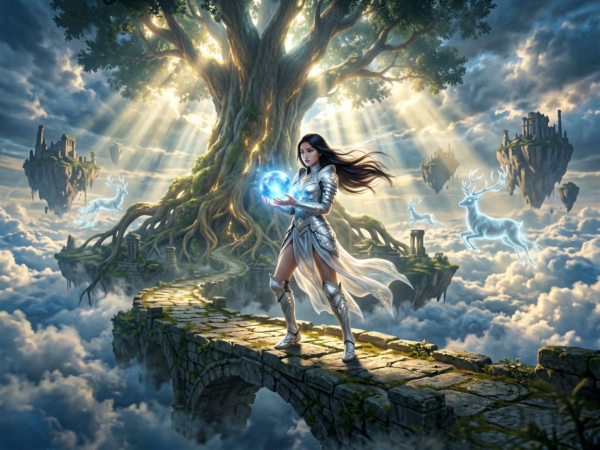
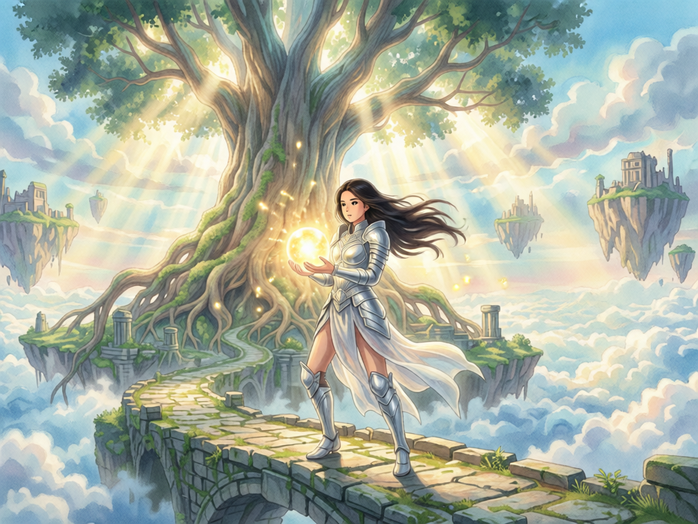

<div align="center">

# 🎨 Agnes AI Image & Video Skill

**Empower AI Agents with Visual Creation Capabilities**

[](https://github.com/qiz7z/Agnes-picture-video-skill/stargazers)
[](https://github.com/qiz7z/Agnes-picture-video-skill/network/members)
[](LICENSE)
[](https://nodejs.org)

English | [中文](README_CN.md)

</div>

---

## ✨ Introduction

> A Skill that enables Claude, WorkBuddy, and other AI Agents to **freely** generate images and videos using Agnes AI API.

## 🚀 Core Capabilities

<table>
<tr>
<td width="50%">

### 🖼️ Image Generation

- ✅ Text-to-Image
- ✅ Image-to-Image
- ✅ Two models available
- ✅ Local file upload support

</td>
<td width="50%">

### 🎬 Video Generation

- ✅ Text-to-Video
- ✅ Image-to-Video
- ✅ Multi-Image Video
- ✅ Keyframe Animation

</td>
</tr>
</table>

## 📦 Quick Start

### Step 1️⃣ Get API Key

Visit [agnes-ai.com](https://agnes-ai.com) to register and get a **free** API Key.

### Step 2️⃣ Configure API Key

**Option A: Config file (Recommended)**

Create `.claude/skills/run-agnes-pic-video/config.json`:
```json
{"api_key": "sk-your-api-key-here"}
```

**Option B: Environment variable**

```bash
# Linux/Mac
export AGNES_API_KEY=sk-your-api-key-here

# Windows PowerShell
$env:AGNES_API_KEY="sk-your-api-key-here"
```

### Step 3️⃣ Start Using

```bash
# 🎨 Generate Image
node .claude/skills/run-agnes-pic-video/driver.mjs image "A cute cat" --output cat.png

# 🎬 Generate Video
node .claude/skills/run-agnes-pic-video/driver.mjs video "A sunset over the ocean" --output sunset.mp4
```

## 🎨 Showcase

### Text-to-Image (agnes-image-2.0-flash)

<table>
<tr>
<td width="50%">

**Prompt:**
> A young girl in silver armor standing on an ancient stone bridge floating above a sea of clouds, her long hair flowing gently in the wind, holding a softly glowing blue crystal orb. Background features a massive glowing ancient tree with roots entwined around broken floating islands, several translucent spirit deer leaping in the distance. Cinematic lighting with Tyndall effect through the clouds, cool blue and warm gold tones, ultra high detail, 8K resolution, fantasy illustration style

</td>
<td width="50%">



</td>
</tr>
</table>

### Image-to-Image (agnes-image-2.1-flash)

<table>
<tr>
<td width="50%">

**Original** → **Ghibli Style**

**Prompt:**
> Transform into Ghibli animation style while preserving the original composition. Keep the silver-armored girl and glowing crystal orb as the main subjects. Apply soft watercolor brushstrokes to the ancient tree and floating islands. Add dynamic blur to the girl's hair and clothing flowing in the wind. Make the crystal orb's glow warmer and brighter. Add small glowing particles around her. Bright and fresh colors, healing atmosphere, high-quality animation screenshot, delicate light and shadow transitions

</td>
<td width="50%">



</td>
</tr>
</table>

## 💰 Pricing

| Feature | Price | Notes |
|:--------|:-----:|:------|
| 🖼️ Image Generation | **FREE** | Usage limits apply |
| 🎬 Video Generation | **FREE** | Usage limits apply |

> 💡 **Yes, you read that right - both image and video generation are FREE!**

## 🎯 Detailed Usage

### 🖼️ Text-to-Image

**Using Driver:**

```bash
# Default model (agnes-image-2.0-flash)
node driver.mjs image "A cute cat sitting on a windowsill" --output cat.png

# Specify model (agnes-image-2.1-flash, better quality)
node driver.mjs image "A cute cat sitting on a windowsill" --model agnes-image-2.1-flash --output cat.png

# Custom size
node driver.mjs image "A cute cat" --size 1024x1024 --output cat.png
```

**Using curl:**

```bash
# agnes-image-2.0-flash (default, fast)
curl -sL "https://apihub.agnes-ai.com/v1/images/generations" \
  -H "Authorization: Bearer YOUR_API_KEY" \
  -H "Content-Type: application/json" \
  -d '{
    "model": "agnes-image-2.0-flash",
    "prompt": "A cute cat sitting on a windowsill",
    "size": "1024x768",
    "extra_body": {
      "response_format": "url"
    }
  }'

# agnes-image-2.1-flash (newer, better quality)
curl -sL "https://apihub.agnes-ai.com/v1/images/generations" \
  -H "Authorization: Bearer YOUR_API_KEY" \
  -H "Content-Type: application/json" \
  -d '{
    "model": "agnes-image-2.1-flash",
    "prompt": "A cute cat sitting on a windowsill",
    "size": "1024x768",
    "extra_body": {
      "response_format": "url"
    }
  }'
```

**Supported Models:**
| Model | Features |
|:------|:---------|
| `agnes-image-2.0-flash` | Fast speed, text-to-image only |
| `agnes-image-2.1-flash` | Higher quality, supports text-to-image AND image-to-image |

---

### 🎨 Image-to-Image (agnes-image-2.1-flash only)

**Using Driver:**

```bash
# Local file
node driver.mjs image "Transform to cyberpunk style" --model agnes-image-2.1-flash --image input.png --output output.png

# URL image
node driver.mjs image "Transform to oil painting style" --model agnes-image-2.1-flash --image "https://example.com/img.png" --output output.png
```

**Using curl:**

```bash
# URL input
curl -sL "https://apihub.agnes-ai.com/v1/images/generations" \
  -H "Authorization: Bearer YOUR_API_KEY" \
  -H "Content-Type: application/json" \
  -d '{
    "model": "agnes-image-2.1-flash",
    "prompt": "Transform into cyberpunk style while preserving composition",
    "size": "1024x768",
    "extra_body": {
      "image": ["https://example.com/input.png"],
      "response_format": "url"
    }
  }'

# Base64 input (Data URI format)
curl -sL "https://apihub.agnes-ai.com/v1/images/generations" \
  -H "Authorization: Bearer YOUR_API_KEY" \
  -H "Content-Type: application/json" \
  -d '{
    "model": "agnes-image-2.1-flash",
    "prompt": "Make it matte black while preserving composition",
    "size": "1024x768",
    "extra_body": {
      "image": ["data:image/png;base64,BASE64_HERE"],
      "response_format": "url"
    }
  }'
```

**⚠️ Important:**
- Input images go in `extra_body.image` array, NOT at top level
- `response_format` must be in `extra_body`, NOT at top level

---

### 🎬 Text-to-Video

**Using Driver:**

```bash
node driver.mjs video "A sunset over the ocean, cinematic lighting, warm golden tones" --output sunset.mp4

# Custom parameters
node driver.mjs video "A cat playing" --width 1152 --height 768 --frames 121 --fps 24 --output cat.mp4
```

**Using curl:**

```bash
curl -sL -X POST "https://apihub.agnes-ai.com/v1/videos" \
  -H "Authorization: Bearer YOUR_API_KEY" \
  -H "Content-Type: application/json" \
  -d '{
    "model": "agnes-video-v2.0",
    "prompt": "A sunset over the ocean, cinematic lighting, warm golden tones",
    "height": 768,
    "width": 1152,
    "num_frames": 121,
    "frame_rate": 24
  }'
```

**Parameters:**
| Parameter | Default | Description |
|:----------|:-------:|:------------|
| `height` | 768 | Video height |
| `width` | 1152 | Video width |
| `num_frames` | 121 | Number of frames |
| `frame_rate` | 24 | Frames per second |

---

### 📹 Image-to-Video

**Using Driver:**

```bash
# Local file
node driver.mjs video "Animate the character with subtle motion" --image photo.png --output anim.mp4

# URL image
node driver.mjs video "Animate the character with subtle motion" --image "https://example.com/img.png" --output anim.mp4
```

**Using curl:**

```bash
curl -sL -X POST "https://apihub.agnes-ai.com/v1/videos" \
  -H "Authorization: Bearer YOUR_API_KEY" \
  -H "Content-Type: application/json" \
  -d '{
    "model": "agnes-video-v2.0",
    "prompt": "Animate the character with subtle breathing motion, hair moving gently in the wind",
    "image": "https://example.com/image.png",
    "num_frames": 121,
    "frame_rate": 24
  }'
```

---

### 🎞️ Multi-Image Video

**Using Driver:**

```bash
# Local files (comma-separated)
node driver.mjs video "Smooth transformation between images" --images "img1.png,img2.png" --output morph.mp4

# Mix of local and URL
node driver.mjs video "Smooth transformation" --images "local.png,https://example.com/remote.png" --output morph.mp4
```

**Using curl:**

```bash
curl -sL -X POST "https://apihub.agnes-ai.com/v1/videos" \
  -H "Authorization: Bearer YOUR_API_KEY" \
  -H "Content-Type: application/json" \
  -d '{
    "model": "agnes-video-v2.0",
    "prompt": "Smooth transformation between images",
    "extra_body": {
      "image": ["https://example.com/img1.png", "https://example.com/img2.png"]
    },
    "num_frames": 121,
    "frame_rate": 24
  }'
```

---

### 🎭 Keyframe Animation

**Using Driver:**

```bash
# Local files with --keyframes flag
node driver.mjs video "Smooth transition between keyframes" --images "key1.png,key2.png" --keyframes --output kf.mp4
```

**Using curl:**

```bash
curl -sL -X POST "https://apihub.agnes-ai.com/v1/videos" \
  -H "Authorization: Bearer YOUR_API_KEY" \
  -H "Content-Type: application/json" \
  -d '{
    "model": "agnes-video-v2.0",
    "prompt": "Smooth transition between keyframes, maintaining character identity",
    "extra_body": {
      "image": ["https://example.com/keyframe1.png", "https://example.com/keyframe2.png"],
      "mode": "keyframes"
    },
    "num_frames": 121,
    "frame_rate": 24
  }'
```

---

### 📊 Poll Video Status

All video generation is asynchronous and returns a `task_id`. Poll until complete:

**Using Driver:**
The driver automatically polls and downloads when complete.

**Using curl:**

```bash
# Check status
curl -sL "https://apihub.agnes-ai.com/v1/videos/TASK_ID" \
  -H "Authorization: Bearer YOUR_API_KEY"
```

**Response:**
```json
{
  "id": "task_xxxxx",
  "status": "completed",
  "remixed_from_video_id": "https://platform-outputs.agnes-ai.space/videos/..."
}
```

When `status` is `"completed"`, the video URL is in `remixed_from_video_id` field.

## 📖 Prompt Recommendations

### Image Generation

```
[Subject] + [Scene] + [Style] + [Lighting] + [Composition] + [Quality]
```

**Example:**
> A luminous floating city above a misty canyon at sunrise, cinematic realism, wide-angle composition, rich architectural details, soft golden light, high visual density

**For image-to-image:** Describe what to change AND what to keep
> Transform the scene into a rain-soaked cyberpunk night with neon reflections while preserving the original composition and main subject layout

### Text-to-Video

```
[Subject] + [Action] + [Scene] + [Camera Movement] + [Lighting] + [Style]
```

**Example:**
> A young astronaut walking across a red desert planet, dust blowing in the wind, slow cinematic tracking shot, dramatic sunset lighting, realistic sci-fi style

### Image-to-Video

```
[What should move] + [What should stay stable]
```

**Example:**
> Animate the character with subtle breathing motion, hair moving gently in the wind, background lights flickering softly, while keeping the face and outfit consistent

### Keyframe Animation

```
[Transition relationship] + [Consistency elements]
```

**Example:**
> Create a smooth transition from the first keyframe to the second keyframe, maintaining character identity, consistent camera angle, and natural motion between scenes

## 🏗️ Project Structure

```
Agnes-picture-video-skill/
├── 📄 README.md                          ← English documentation
├── 📄 README_CN.md                       ← Chinese documentation
├── 📄 .gitignore
├── 📁 examples/                          ← Example images
│   ├── 🖼️ text-to-image.png             ← Text-to-Image example
│   └── 🖼️ image-to-image.png            ← Image-to-Image example
└── 📁 .claude/skills/run-agnes-pic-video/
    ├── 📄 SKILL.md                       ← Agent instructions (self-contained)
    ├── 📄 driver.mjs                     ← Node.js driver script
    └── 📄 config.json                    ← API Key config (create this)
```

## 🤖 Agent Compatibility

| Agent | Support | Notes |
|:------|:-------:|:------|
| Claude Code | ✅ | Full support |
| WorkBuddy | ✅ | Via SKILL.md |
| Other Agents | ✅ | Any agent that supports Skills |

## ⚠️ Important Notes

> **API Base URL:** `apihub.agnes-ai.com` (NOT `api.agnes-ai.com`)

> **Image-to-Image:** Put input images in `extra_body.image` array, NOT at top level

> **response_format:** Must be in `extra_body`, NOT at top level (causes 400 error)

> **Video URL:** Located in `remixed_from_video_id` field after completion

> **Video Generation:** Takes 1-3 minutes, driver auto-polls until complete

## 📚 Documentation

- [English](README.md)
- [中文](README_CN.md)
- [Skill Details](.claude/skills/run-agnes-pic-video/SKILL.md)

## 🤝 Contributing

Issues and Pull Requests are welcome!

## ⭐ Star

If this project helps you, please give it a Star!

<div align="center">

**[⬆ Back to Top](#-agnes-ai-image--video-skill)**

</div>

---

<div align="center">

**Made with ❤️ by [qiz7z](https://github.com/qiz7z)**

</div>
