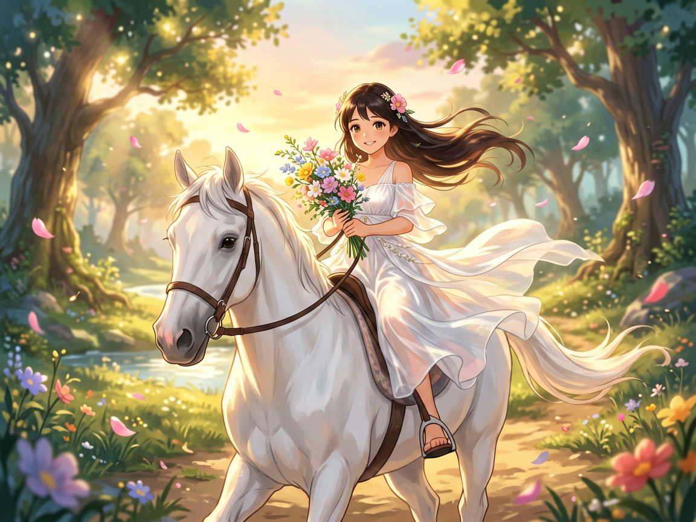

<div align="center">

# 🎨 Agnes AI 图片 & 视频生成 Skill

**让 AI Agent 具备视觉创作能力**

[](https://github.com/qiz7z/Agnes-picture-video-skill/stargazers)
[](https://github.com/qiz7z/Agnes-picture-video-skill/network/members)
[](LICENSE)
[](https://nodejs.org)

[English](README.md) | 中文

</div>

---

## ✨ 一句话介绍

> 一个让 Claude、WorkBuddy 等 AI Agent **免费**调用 Agnes AI API 生成图片和视频的 Skill。

## 🚀 核心能力

<table>
<tr>
<td width="50%">

### 🖼️ 图片生成

- ✅ 文生图（Text-to-Image）
- ✅ 图生图（Image-to-Image）
- ✅ 两个模型可选
- ✅ 支持本地文件上传

</td>
<td width="50%">

### 🎬 视频生成

- ✅ 文生视频（Text-to-Video）
- ✅ 图生视频（Image-to-Video）
- ✅ 多图视频（Multi-Image）
- ✅ 关键帧动画（Keyframe）

</td>
</tr>
</table>

## 📦 快速开始

### Step 1️⃣ 获取 API Key

访问 [agnes-ai.com](https://agnes-ai.com) 注册，**免费**获取 API Key。

### Step 2️⃣ 配置 API Key

**方式一：配置文件（推荐）**

创建 `.claude/skills/run-agnes-pic-video/config.json`：
```json
{"api_key": "sk-你的API密钥"}
```

**方式二：环境变量**

```bash
# Linux/Mac
export AGNES_API_KEY=sk-你的API密钥

# Windows PowerShell
$env:AGNES_API_KEY="sk-你的API密钥"
```

### Step 3️⃣ 开始使用

```bash
# 🎨 生成图片
node .claude/skills/run-agnes-pic-video/driver.mjs image "一只可爱的猫" --output cat.png

# 🎬 生成视频
node .claude/skills/run-agnes-pic-video/driver.mjs video "海边日落" --output sunset.mp4
```

## 🎨 效果展示

### 文生图（agnes-image-2.0-flash）

<table>
<tr>
<td width="50%">

**提示词：**
> 一位身穿银色轻甲的少女站在悬浮于云海之上的古老石桥上，长发随风飘动，手中托着一颗散发柔和蓝光的水晶球。背景是巨大的发光古树，树根缠绕着残破的浮空岛屿，几只半透明的灵鹿在远处跳跃。画面采用电影级光影，丁达尔光效穿透云层，色调以冷蓝与暖金交织，超高细节，8K分辨率，奇幻插画风格

</td>
<td width="50%">


</td>
</tr>
</table>

### 图生图（agnes-image-2.1-flash）

<table>
<tr>
<td width="50%">

**原图** → **吉卜力风格**

**提示词：**
> 基于原图构图，将画面转换为吉卜力动画风格。保留银甲少女和发光水晶球的核心主体，背景的古树和浮空岛屿采用柔和的水彩笔触。少女的头发和衣摆增加随风飘动的动态模糊，水晶球的光芒更加温暖明亮，几只发光的微小光斑环绕在她周围。色彩明亮清新，充满治愈感，高质量动画截图，细腻的光影过渡

</td>
<td width="50%">


</td>
</tr>
</table>

### 原神风格（agnes-image-2.1-flash）

<table>
<tr>
<td width="50%">

**提示词：**
> Genshin Impact anime style, a beautiful young girl in a flowing white dress riding gracefully on a white horse, a bouquet of colorful flowers in her arms, long hair flowing in the wind, approaching the viewer on a magical path, fantasy landscape with glowing trees and floating petals, soft golden hour lighting, vibrant colors, high quality anime art, 8K detail, cinematic composition

</td>
<td width="50%">



</td>
</tr>
</table>

## 💰 价格

| 功能 | 价格 | 说明 |
|:-----|:-----|:-----|
| 🖼️ 图片生成 | **免费** | 有额度限制 |
| 🎬 视频生成 | **免费** | 有额度限制 |

> 💡 **是的，你没看错，图片和视频生成都是免费的！**

## 🛠️ Driver 帮助

```bash
# 查看所有可用命令和选项
node driver.mjs --help
node driver.mjs -h
```

**输出：**
```
Agnes AI Image & Video Generation Driver

Usage:
  node driver.mjs image "prompt" [options]     Generate image
  node driver.mjs video "prompt" [options]     Generate video
  node driver.mjs status <task_id>             Check video status

Image options:
  --size <WxH>        Image size (default: 1024x768)
  --model <model>     Model: agnes-image-2.0-flash, agnes-image-2.1-flash
  --image <path>      Input image for image-to-image (agnes-image-2.1-flash)
  --output <path>     Save image to file

Video options:
  --width <num>       Video width (default: 1152)
  --height <num>      Video height (default: 768)
  --frames <num>      Number of frames (default: 121)
  --fps <num>         Frame rate (default: 24)
  --image <path>      Input image for image-to-video
  --images <paths>    Comma-separated images for multi-image/keyframe
  --keyframes         Enable keyframe mode (use with --images)
  --output <path>     Save video to file
```

## ⏱️ 超时设置

| 操作 | 超时时间 |
|:-----|:--------:|
| API 调用（图片/视频生成） | 60 秒 |
| 文件下载（图片/视频） | 5 分钟 |
| 轮询单次请求 | 60 秒（失败自动重试） |

如果超时，Driver 会显示清晰的错误提示。

## 🎯 详细使用方法

### 🖼️ 文生图（Text-to-Image）

**使用 Driver：**

```bash
# 默认模型（agnes-image-2.0-flash）
node driver.mjs image "一只可爱的猫坐在窗台上" --output cat.png

# 指定模型（agnes-image-2.1-flash，效果更好）
node driver.mjs image "一只可爱的猫坐在窗台上" --model agnes-image-2.1-flash --output cat.png

# 自定义尺寸
node driver.mjs image "一只可爱的猫" --size 1024x1024 --output cat.png
```

**使用 curl：**

```bash
# agnes-image-2.0-flash（默认，速度快）
curl -sL "https://apihub.agnes-ai.com/v1/images/generations" \
  -H "Authorization: Bearer 你的API_KEY" \
  -H "Content-Type: application/json" \
  -d '{
    "model": "agnes-image-2.0-flash",
    "prompt": "一只可爱的猫坐在窗台上",
    "size": "1024x768",
    "extra_body": {
      "response_format": "url"
    }
  }'

# agnes-image-2.1-flash（新版本，质量更高）
curl -sL "https://apihub.agnes-ai.com/v1/images/generations" \
  -H "Authorization: Bearer 你的API_KEY" \
  -H "Content-Type: application/json" \
  -d '{
    "model": "agnes-image-2.1-flash",
    "prompt": "一只可爱的猫坐在窗台上",
    "size": "1024x768",
    "extra_body": {
      "response_format": "url"
    }
  }'
```

**支持的模型：**
| 模型 | 特点 |
|:-----|:-----|
| `agnes-image-2.0-flash` | 速度快，仅支持文生图 |
| `agnes-image-2.1-flash` | 质量更高，支持文生图和图生图 |

---

### 🎨 图生图（Image-to-Image）— 仅 agnes-image-2.1-flash

**使用 Driver：**

```bash
# 本地图片
node driver.mjs image "转换为赛博朋克风格" --model agnes-image-2.1-flash --image input.png --output output.png

# URL 图片
node driver.mjs image "转换为油画风格" --model agnes-image-2.1-flash --image "https://example.com/img.png" --output output.png
```

**使用 curl：**

```bash
# URL 输入
curl -sL "https://apihub.agnes-ai.com/v1/images/generations" \
  -H "Authorization: Bearer 你的API_KEY" \
  -H "Content-Type: application/json" \
  -d '{
    "model": "agnes-image-2.1-flash",
    "prompt": "转换为赛博朋克风格，保留原图构图",
    "size": "1024x768",
    "extra_body": {
      "image": ["https://example.com/input.png"],
      "response_format": "url"
    }
  }'

# Base64 输入（Data URI 格式）
curl -sL "https://apihub.agnes-ai.com/v1/images/generations" \
  -H "Authorization: Bearer 你的API_KEY" \
  -H "Content-Type: application/json" \
  -d '{
    "model": "agnes-image-2.1-flash",
    "prompt": "转换为哑光黑色，保留原图构图",
    "size": "1024x768",
    "extra_body": {
      "image": ["data:image/png;base64,BASE64_HERE"],
      "response_format": "url"
    }
  }'
```

**⚠️ 重要说明：**
- 输入图片放在 `extra_body.image` 数组中，**不是**顶层
- `response_format` 必须放在 `extra_body` 中，**不是**顶层

---

### 🎬 文生视频（Text-to-Video）

**使用 Driver：**

```bash
node driver.mjs video "海边日落，电影级光影，温暖金色调" --output sunset.mp4

# 自定义参数
node driver.mjs video "一只猫在玩耍" --width 1152 --height 768 --frames 121 --fps 24 --output cat.mp4
```

**使用 curl：**

```bash
curl -sL -X POST "https://apihub.agnes-ai.com/v1/videos" \
  -H "Authorization: Bearer 你的API_KEY" \
  -H "Content-Type: application/json" \
  -d '{
    "model": "agnes-video-v2.0",
    "prompt": "海边日落，电影级光影，温暖金色调",
    "height": 768,
    "width": 1152,
    "num_frames": 121,
    "frame_rate": 24
  }'
```

**参数说明：**
| 参数 | 默认值 | 说明 |
|:-----|:------:|:-----|
| `height` | 768 | 视频高度 |
| `width` | 1152 | 视频宽度 |
| `num_frames` | 121 | 帧数 |
| `frame_rate` | 24 | 帧率 |

---

### 📹 图生视频（Image-to-Video）

**使用 Driver：**

```bash
# 本地图片
node driver.mjs video "让角色动起来，头发随风飘动" --image photo.png --output anim.mp4

# URL 图片
node driver.mjs video "让角色动起来，头发随风飘动" --image "https://example.com/img.png" --output anim.mp4
```

**使用 curl：**

```bash
curl -sL -X POST "https://apihub.agnes-ai.com/v1/videos" \
  -H "Authorization: Bearer 你的API_KEY" \
  -H "Content-Type: application/json" \
  -d '{
    "model": "agnes-video-v2.0",
    "prompt": "让角色动起来，头发随风飘动，保持面部表情不变",
    "image": "https://example.com/image.png",
    "num_frames": 121,
    "frame_rate": 24
  }'
```

---

### 🎞️ 多图视频（Multi-Image）

**使用 Driver：**

```bash
# 本地图片（逗号分隔）
node driver.mjs video "图片之间的平滑变换" --images "img1.png,img2.png" --output morph.mp4

# 混合本地和 URL
node driver.mjs video "平滑变换" --images "local.png,https://example.com/remote.png" --output morph.mp4
```

**使用 curl：**

```bash
curl -sL -X POST "https://apihub.agnes-ai.com/v1/videos" \
  -H "Authorization: Bearer 你的API_KEY" \
  -H "Content-Type: application/json" \
  -d '{
    "model": "agnes-video-v2.0",
    "prompt": "图片之间的平滑变换",
    "extra_body": {
      "image": ["https://example.com/img1.png", "https://example.com/img2.png"]
    },
    "num_frames": 121,
    "frame_rate": 24
  }'
```

---

### 🎭 关键帧动画（Keyframe）

**使用 Driver：**

```bash
# 本地图片 + --keyframes 标志
node driver.mjs video "关键帧之间的平滑过渡" --images "key1.png,key2.png" --keyframes --output kf.mp4
```

**使用 curl：**

```bash
curl -sL -X POST "https://apihub.agnes-ai.com/v1/videos" \
  -H "Authorization: Bearer 你的API_KEY" \
  -H "Content-Type: application/json" \
  -d '{
    "model": "agnes-video-v2.0",
    "prompt": "关键帧之间的平滑过渡，保持角色身份一致",
    "extra_body": {
      "image": ["https://example.com/keyframe1.png", "https://example.com/keyframe2.png"],
      "mode": "keyframes"
    },
    "num_frames": 121,
    "frame_rate": 24
  }'
```

---

### 📊 查询视频状态

所有视频生成都是异步的，会返回 `task_id`。需要轮询直到完成：

**使用 Driver：**
Driver 会自动轮询并在完成后下载视频。

**使用 curl：**

```bash
# 查询状态
curl -sL "https://apihub.agnes-ai.com/v1/videos/TASK_ID" \
  -H "Authorization: Bearer 你的API_KEY"
```

**响应示例：**
```json
{
  "id": "task_xxxxx",
  "status": "completed",
  "remixed_from_video_id": "https://platform-outputs.agnes-ai.space/videos/..."
}
```

当 `status` 为 `"completed"` 时，视频 URL 在 `remixed_from_video_id` 字段中。

## 📖 Prompt 推荐

### 图片生成

```
[主体] + [场景] + [风格] + [光照] + [构图] + [质量]
```

**示例：**
> 一位身穿银色轻甲的少女站在悬浮于云海之上的古老石桥上，电影级光影，丁达尔光效穿透云层，超高细节，8K分辨率，奇幻插画风格

**图生图：** 说明要改什么 + 要保留什么
> 将画面转换为赛博朋克风格，添加霓虹灯和湿润路面反射，同时保留原始街道布局和建筑形状

### 文生视频

```
[主体] + [动作] + [场景] + [镜头运动] + [光照] + [风格]
```

**示例：**
> 一位少女站在石桥上，长发随风飘动，缓慢推镜，电影级光影，奇幻风格

### 图生视频

```
[什么要动] + [什么要保持不变]
```

**示例：**
> 让角色的头发和衣服随风飘动，水晶球发出温暖的光芒，同时保持面部表情和服装不变

### 关键帧动画

```
[过渡关系] + [一致性元素]
```

**示例：**
> 从第一帧平滑过渡到第二帧，保持角色身份一致，镜头角度不变

## 🏗️ 项目结构

```
Agnes-picture-video-skill/
├── 📄 README.md                          ← 英文文档
├── 📄 README_CN.md                       ← 中文文档（本文件）
├── 📄 .gitignore
├── 📁 examples/                          ← 示例图片
│   ├── 🖼️ text-to-image.png             ← 文生图示例
│   └── 🖼️ image-to-image.png            ← 图生图示例
└── 📁 .claude/skills/run-agnes-pic-video/
    ├── 📄 SKILL.md                       ← Agent 使用说明（自包含）
    ├── 📄 driver.mjs                     ← Node.js 驱动脚本
    └── 📄 config.json                    ← API Key 配置（需创建）
```

## 🤖 Agent 兼容性

| Agent | 支持情况 | 说明 |
|:------|:-------:|:------|
| Claude Code | ✅ | 完整支持 |
| WorkBuddy | ✅ | 通过 SKILL.md |
| 其他 Agent | ✅ | 任何支持 Skill 的 Agent |

## ⚠️ 重要说明

> **API 地址：** `apihub.agnes-ai.com`（不是 `api.agnes-ai.com`）

> **图生图：** 输入图片放在 `extra_body.image` 数组中，不是顶层

> **response_format：** 必须放在 `extra_body` 中，放顶层会报 400 错误

> **视频 URL：** 完成后在 `remixed_from_video_id` 字段中

> **视频生成：** 需要 1-3 分钟，Driver 会自动轮询直到完成

## 📚 文档

- [英文文档](README.md)
- [中文文档](README_CN.md)
- [Skill 详细说明](.claude/skills/run-agnes-pic-video/SKILL.md)

## 🤝 贡献

欢迎提交 Issue 和 Pull Request！

## ⭐ Star

如果这个项目对你有帮助，请给个 Star 支持一下！

<div align="center">

**[⬆ 回到顶部](#-agnes-ai-图片--视频生成-skill)**

</div>

---

<div align="center">

**Made with ❤️ by [qiz7z](https://github.com/qiz7z)**

</div>
